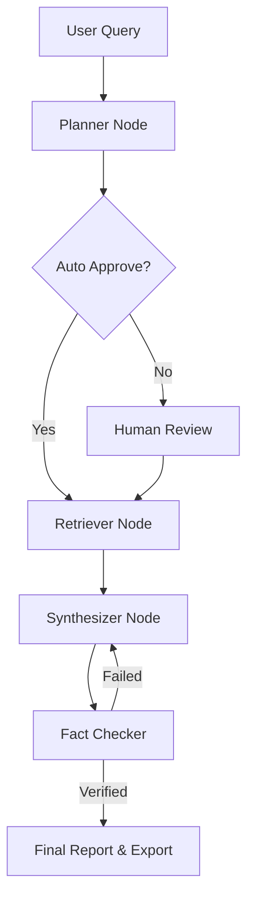

# 🤖 Autonomous Multi-Agent AI Research Workspace

[](https://www.python.org/)
[](https://langchain-ai.github.io/langgraph/)
[](https://fastapi.tiangolo.com/)
[](https://streamlit.io/)
[](LICENSE)

An agentic, multi-node research platform powered by LangGraph, FastAPI, and Streamlit. The system plans research tasks, retrieves web sources, synthesizes structured technical reports, streams updates live in the UI, and verifies claims through a built-in fact-checking guardrail.

## ✨ Key Features

- ⚡ Real-time token streaming for live draft generation
- ✋ Human-in-the-loop review before web retrieval begins
- 🔄 Stateful workflow orchestration with checkpointing and resume support
- 🛡️ Automated fact-verification for generated claims
- 📥 Markdown and Word export for finished research reports
- 💬 Post-generation chat over gathered sources

## 🏗️ Architecture



## 🛠️ Tech Stack

- Agent Framework: LangGraph / LangChain
- Backend API: FastAPI / Uvicorn
- Frontend UI: Streamlit
- LLM Engine: LM Studio or any OpenAI-compatible endpoint
- Document Export: python-docx
- State Persistence: AsyncSqliteSaver

## 🚀 Quickstart

### Prerequisites

- Python 3.10+
- A local LLM endpoint such as LM Studio running at an OpenAI-compatible API URL

### 1. Clone the repository

```bash
git clone https://github.com/YOUR_USERNAME/YOUR_REPO_NAME.git
cd YOUR_REPO_NAME
```

### 2. Create and activate a virtual environment

```bash
python -m venv venv
source venv/bin/activate
# On Windows: venv\Scripts\activate
```

### 3. Install dependencies

```bash
pip install -r requirements.txt
```

### 4. Run the backend and frontend

Open two terminals.

Terminal 1 — Backend:

```bash
uvicorn main:app --reload --port 8000
```

Terminal 2 — Frontend:

```bash
streamlit run app.py
```

Then open http://localhost:8501 in your browser.

## 📡 API Endpoints

- POST /research/stream — Start research and stream node updates and tokens
- POST /research/resume — Resume a paused workflow after plan approval
- POST /research/chat — Ask follow-up questions using gathered research context

## 📁 Project Structure

```text
.
├── app.py            # Streamlit frontend
├── graph.py          # LangGraph workflow and agent nodes
├── main.py           # FastAPI backend
├── schemas.py        # Pydantic models
├── tools.py          # Search and retrieval helpers
├── prompt.txt        # Prompt template
├── requirements.txt  # Python dependencies
└── README.md         # Project documentation
```

## 📄 License

This project is licensed under the MIT License. See the LICENSE file for details.